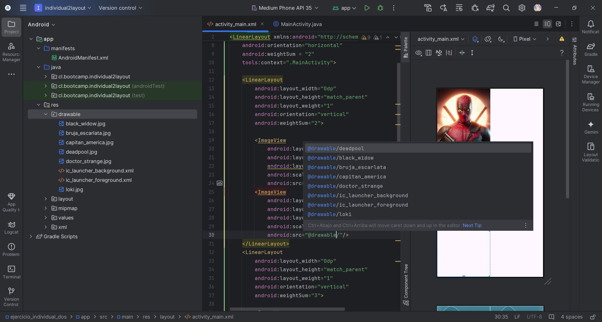
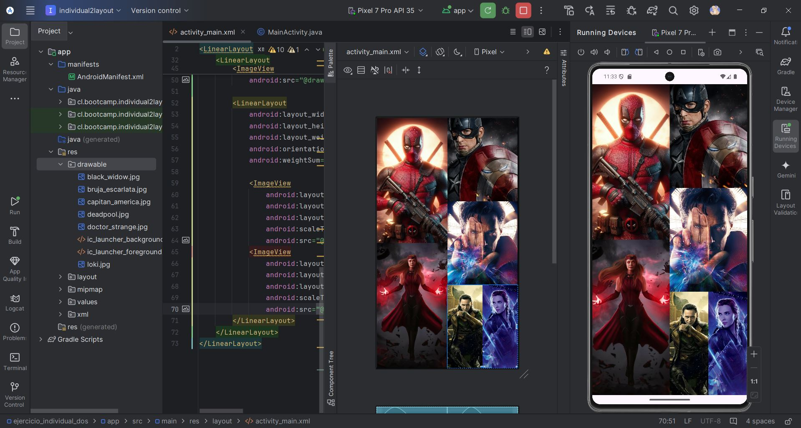
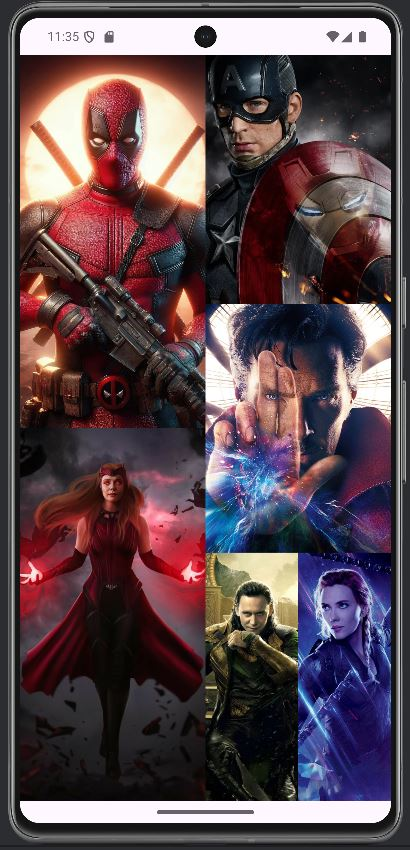

**_<h1 align="center">:vulcan_salute: Ejercicio Individual Dos - alineamiento Linear Layout :computer:</h1>_**

Proyecto realizado con anidamiento de Linear Layout y con ImageView de acuerdo a las instrucciones:

1. Crea un nuevo proyecto que tenga como base un __LinearLayout__ en su *activity_main.xml*

2. Distribuye el layout de tal manera que organices 6 imágenes en diferentes tamaños __(Ver imagen de referencia para conocer el diseño que debe tener el Layout)__.

3. Utiliza __ImageView__ para agregar las imágenes _(El contenido de estas es de libre elección)_.

4. Para entregar el proyecto **solo basta con capturas** del código .xml y la vista emulada (virtual o física).

 

 
